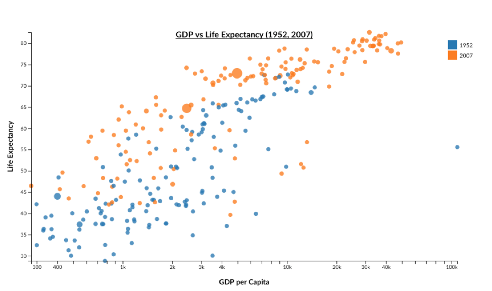
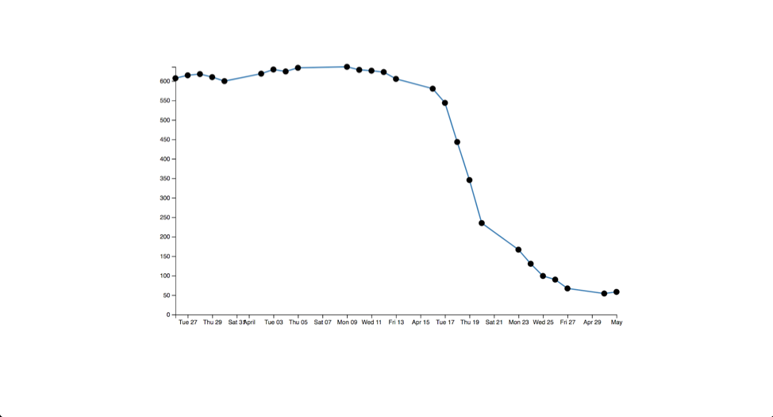
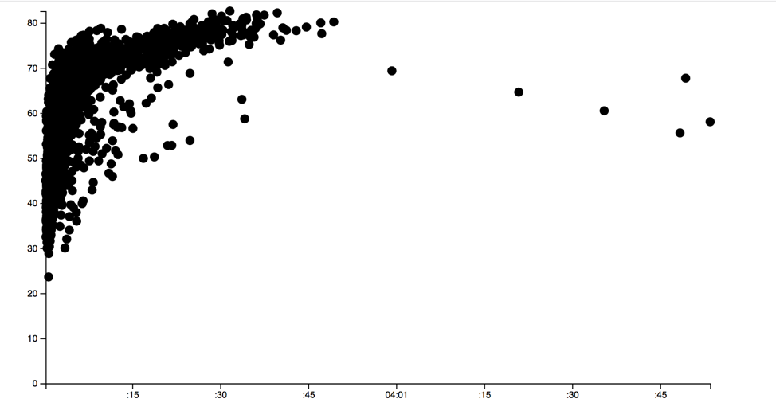
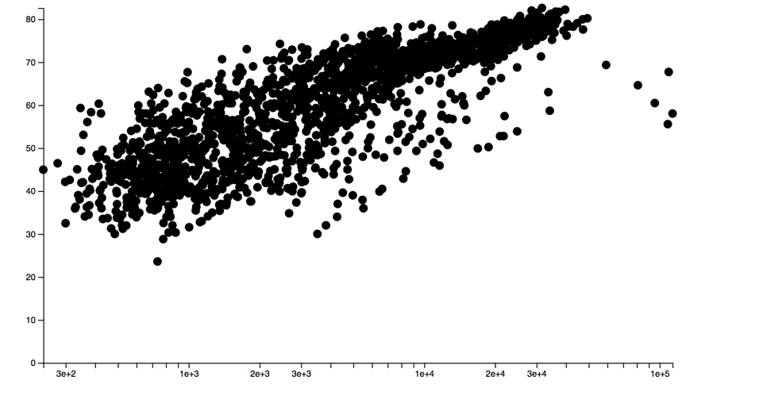
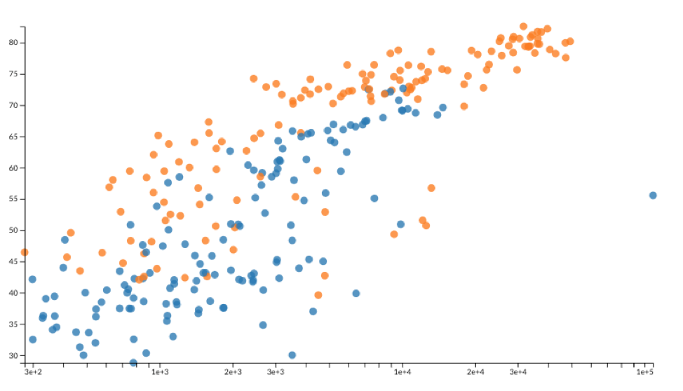
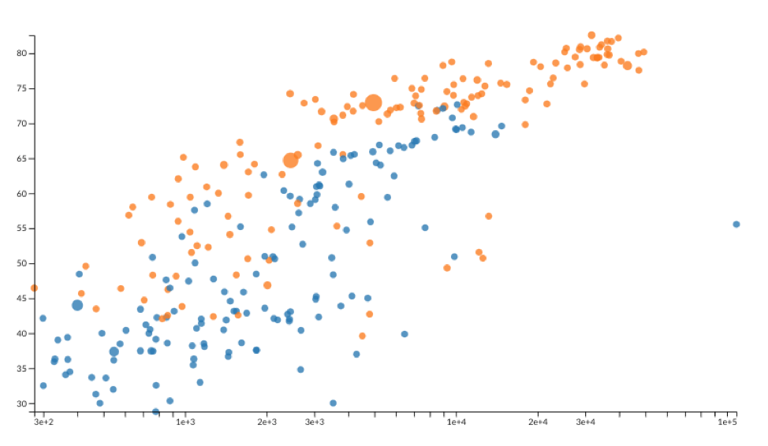
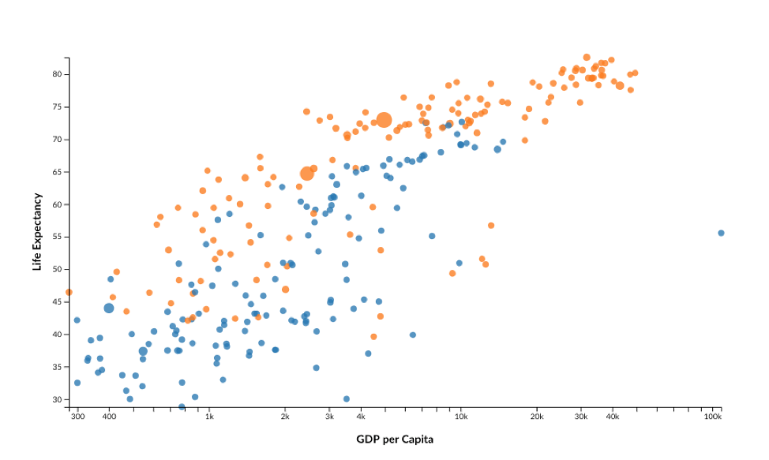
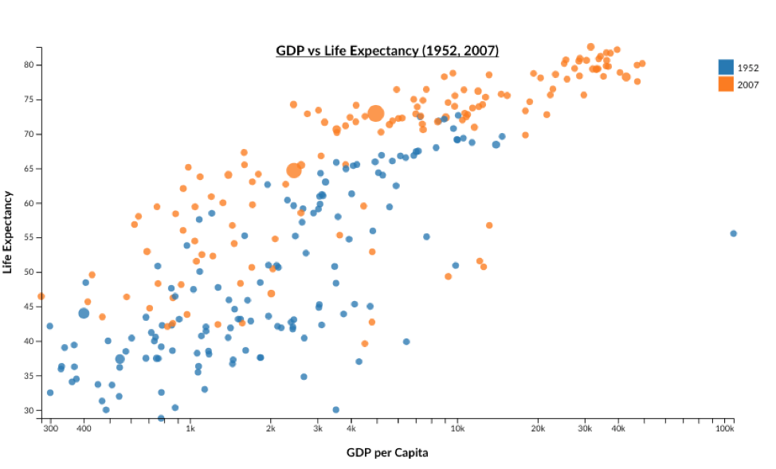

# Homework #2: D3 Simple

The purpose of this homework is to teach you some basic grammar and functionalities contained in D3.js:

* Change a dataset
* Perform DOM selection
* Manipulate axes
* Filter data
* Add legends
* Use the D3 domain, range, and scale functions
* Use a D3 color schema

The starter codes for this semester will be given with D3.v5. The latestt D3 version is v6. You are allowed to using either version for your homeworks and course project, but **you may not use a version older than v5**.

## Data Description

This assignment uses data from _gapminderDataFiveYear.tsv_ (see the data folder). From 1952 to 2007, this data lists a series of countries and its corresponding population, life expectancy, and GDP every 5 years.

## To start the assignment

* Clone this code to your local machine.
* Using your local server, open the **index.html** file. (Remeber, homeworks will be graded using Firefox.)
* Modify the source code according to the instructions below.
* Commit and push the code back to this repository to submit it. The finished chart in index.html should look like this:

## Assignment Steps

### Step 1:
Currently, the SVG element (which contains our chart) is appended to the page's body. In the HTML file, there is a div with the class `center`. Modify the file to append the SVG element to the `center` div instead of the body.

### Step 2:
Change the default dataset that's loaded in (currently dates.csv) to the gapminderDataFiveYear.tsv located in the “data/” folder. This dataset contains information about a country such as population, life expectancy, and gross domestic product (GDP) from 1952 to 2007.

Since d3 doesn't have any information about the data types of the new file, it interprets every data value as a string. In order for you to be able to use the numerical columns as such, you'll need to convert each row of the data to the correct format. D3's data loading functions (e.g. d3.csv, d3.tsv) have a provision for that, which is documented [here](https://github.com/d3/d3-fetch/blob/master/README.md#tsv). You can also do the converting after you have loaded the data.

The original dates.csv dataset maps the `date` and `close` attributes using both lines and circles. Comment out the line mapping and change the circle values so `gdpPercap` is now plotted on the x-axis and `lifeExp` on the y-axis.

> 🔍 **Hint:** When you change the dataset of a visualization, keep in mind that you'll have to re-define your scales and the attribute mappings that use them to use your new data.

> 🔍 **Hint:** Note that CSV (comma-separated values) and TSV (tab-separated values) are different data formats, and d3 won't handle this for you automatically. 

### Step 3:
Looking at our chart now, we can see a few outliers but there's a lot of occlusion (overlapping points) preventing us from observing all of the data. There are a few ways to mitigate this, but in this case we'll be changing the scale on which our data is displayed. 

Change the x-axis’s range from linear/scalar to log scale. 

### Step 4:
We want to visualize the relationship of GDP per Capita and Life Expectancy in 1952 and 2007, in order to observe how this relationship has changed over the period of time our dataset covers. 

Currently, the chart shows all of the years present in the dataset between 1952 and 2007. Filter the dataset such that only 1952 and 2007 are shown.

Once that's done, we have just those two years present on the scatterplot but we can't distinguish between them. To remedy this, use D3’s Category 10 color scheme to distinguish the points. In addition, lower the opacity for each circle to 0.8.

> 🔍 **Hint:** You will need to first declare D3’s Category 10 scheme before using it. Then you will need to declare an attribute that will fill the points based on the year.

### Step 5:

Currently, each circle is is given a static radius of 5 (value in pixels). Modify each circle’s radius to its corresponding population size in the dataset. Scale the circle sizes based on the country's population, ranging from 4 to 10 pixels. 

> 🔍 **Hint:** You'll need to create a D3 `range` and `domain` to do this.

### Step 6:

Modify the x-axis so it has 11 ticks, with a `.0s` format using the `Lato` font family.

> 🔍 **Hint:** The zero (0) enables zero-padding, while the _s_ is a decimal notation rounded to the next significant digit. This is using d3-format's notation, which is similar to something like printf's format specification in C.

Then, add label titles `GDP per Capita` and `Life Expectancy` to the x and y axis respectively. The axes titles must have the following styling characteristics: `sans-serif font family, size 14px, font-weight of 700 (bolded)`. The y-axis label should be rotated, and both labels should be centered on their respective axis.

### Step 7:

It’s important to help your audience understand what is going on in the chart. To do this, add a legend at the upper right corner of the chart. Lastly, create a title (i.e., "GDP vs Life Expectancy (1952, 2007)") for your chart.

Chart title must be using the `sans-serif font-family, size 16px, bolded, and underlined`.

Legend titles must be using the `sans-serif` font-family and size `11px`.

> 🔍 **Hint:** A legend just has to indicate what the visualization's encodings mean. In this case, it can be as simple as a rectangle and some text indicating what each color in the visualization is connected to. 

Once you are finished with Step 6 and you have your chart looking like the last screenshot, you are done! Be sure to commit and push your completed code by the deadline.

