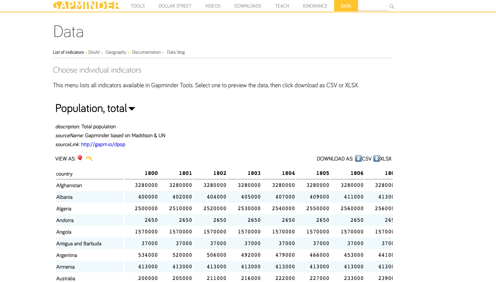

# Fancy GapMinder

In this homework, you'll apply knowledge of animations and joins to create a scatterplot that animates as attribute and years for the dataset are updated, which is popularly known as the GapMinder scatterplot. **This assignment is worth 10 points.** It will include the following aspects:

* Download a set of four data attributes from the [GapMinder Data website](https://www.gapminder.org/data/) for use in your scatterplot.
* Display a scatterplot on your webpage that shows two selected attributes for a specific year for a regional set of countries (Africa, North America, etc.).
* Be able to change the year shown in the scatterplot, by (1) inputting a specific year in an HTML `input` box, or (2) by starting/stopping an animation that iterates through the years in your dataset. Whenever the year changes, use animated transitions to update the positions of items on the scatterplot.
* The user can also change the attributes shown in the scatterplot. Again, you'll use animated transitions to update the positions of items.
* The user can also switch to a different regional set of countries. Use animated joins to make the "outgoing countries" disappear and "incoming countries" appear on the scatterplot.

We don't give you any starter code for this assignment: you'll have to create everything from scratch, including creating the dataset and `index.html` page. You also have freedom to stylize your chart as desired, though it should look nice.

> 🔍 This link shows a couple of versions of the GapMinder scatterplot: [World Health Chart](https://www.gapminder.org/fw/world-health-chart/). You won't be implementing all of the features on these example scatterplots, such as sizing the circles based on an attribute, and you do not have to implement zooming and panning, but you will need to be able to animate the circles in your scatterplot as years change.

> ❗️ While you can find D3 implementations of the GapMinder scatterplot online, what this homework asks you to do is quite different from those, as you'll incorporate specific several interactions and animations into the display. If your strategy is "_start by looking at some online example's code_," it will take you just as much, if not more, effort to understand what's happening in their codebase and then change that code to match what this assignment requires. The correct way to do this assignment is to write your own code that is clean and that you understand. Put another way, **do your own work on this assignment**. As always, sharing and copying code with other students is considering cheating, and passing off (part of) a codebase you found online as your own is plagiarism.

## Step 1: Create your dataset

Use the [GapMinder data interface](https://www.gapminder.org/data/) to create a dataset. Select a minimum of four attributes (the GapMinder Data page calls them _indicators_) and download them as CSV files. Each attribute/indicator will download as a single file that lists the countries as rows and the years (1800–2100) as columns, meaning you'll have a total of four downloaded CSV files.

 Here's a screenshot for the GapMinder interface with the **Population, total** indicator selected:

 

 There's a `data` folder in this assignment where you should place the four downloaded CSV files. The `data` folder already contains a `country_regions.csv` which you will use to map the countries to their geographic regions (Europe & Central Asia, Latin America & Caribbean, etc.).

## Step 2: Create your initial webpage

Create an `index.html` page for your interface in the root directory of this assignment repository. Link to the D3 library, and if desired, create external CSS or JS files to put your code. You may also use Bootstrap if you like, though this is not required.

The exact design of your webpage is up to you, but it should include the following. 
* You'll need an SVG to hold your scatterplot. The size should be between 720 x 480 and 1920 x 1080. 
* In addition, you'll need the following HTML controls (with text labels) to update your scatterplot.

    * **X attribute:** A `select` dropdown listing your four attributes. The selected attribute will be what is mapped along the x-axis in the scatterplot.
    * **Y attribute:** A `select` dropdown listing your four attributes. The selected attribute will be what is mapped along the y-axis in the scatterplot.
    * **Region**: A `select` dropdown listing the region options in the `countries_regions.csv` file in the **World bank region** column. There are seven regions here. The countries for the currently selected region will be what is shown in the scatterplot. You can optionally add an **All** option in this dropdown to visualize all 197 countries, though this is not required.
    * **Year:** An `<input type='number'>` element ([link](https://developer.mozilla.org/en-US/docs/Web/HTML/Element/input/number)) that denotes the currently selected year. The selected year will be what is shown in the scatterplot. Optionally, you can also add a range slider beside this element that lets the user modify the year by scrubbing along the slider. If you do this, make sure both elements update to show the same values.
    * **Play:** A control that lets the user start and stop year playback. One way to do this is with an `<input type='button'>` element ([link](https://developer.mozilla.org/en-US/docs/Web/HTML/Element/input/button)). When first pressed, the scatterplot will begin animating through the years. If pressed again, the animation will stop on the current year. When the playback is paused, the button's text should read "Play". When playback is currently happening, the button's text should read "Pause". (Alternatively, instead of a "Play/Pause" button, you could add an icon or image that alternates between Play and Pause images, similar to the first example on the [World Health Chart](https://www.gapminder.org/fw/world-health-chart/) page.)

My suggestion is to place these control elements in a container (such as a `div`) so they can be organized and styled in a way that makes sense. The controls can be placed either above, below, or to the side of the scatterplot. Feel free to use CSS to give them your own styling (that looks nice).

## Step 3: Import/wrangle your dataset

Import the five CSV files into your page: the four CSV files downloaded in Step #1, along with the `countries_regions.csv` file. You may do any data wrangling you feel is necessary, either before or after importing your data files. The point of this step is to get the dataset to a point where, based on the user interacting with the HTML controls, the scatterplot will select the appropriate region of countries and their attribute values for the current year, and display them on the scatterplot appropriately.

The GapMinder indicators go from 1800 to 2100, but you are allowed to subset this time range to only go from 1800-2020 if desired.

## Step 4: Create the interactive scatterplot

Your scatterplot should show and do the following:

* Based on the selections in the **X attribute**, **Y attribute**, **Region**, and **Year** controls, plot the region's countries on the scatterplot for the selected year.
* Use linear scales for the y and x axes. The domain for each axis should go from 0 to the maximum value of the selected attribute for _all years in your dataset_ (ie, 1800-2020 or 1800-2100), not just the currently selected year. This means that, as your years update, your axes will not. When the user changes to a different attribute, at that point you can redraw the axis using the max value for that attribute. Be sure to label each axis.
* Each country in the scatterplot should be visualized as a circle with a dark border. All circles should be the same size. For each country's circle, add the abbreviation text centered on its circle. Country abbreviations are in the **geo** column in the `countries_regions.csv` file. The abbreviation text should fully fit inside the circle, so it's okay to tweak the text size and circle size to accomodate this. (Note that country abbreviations are 3 letters long.) Make sure the abbreviation text is still readable however. The circles for each region should have their own color (eg, all Latin America & Caribbean countries are color A, while Europe & Central Asia countries are color B, etc.).
* When the `Year` control is updated, animate each country from its current position to its new position based on their attribute values for the new year.
* Likewise, when the `X attribute` and `Y attribute` values are updated, update the appripriate axis and animate the countries to their new positions based on the new attribute. You can simply redraw the updated axis without a transition, but the countries should animate without being redrawn.
* If the `Play` button is clicked, begin iterating through years. The circles in the scatterplot should fully animate for each year update, and the `Year` control's text should likewise update. If you reach the last year of the dataset, stop the animation. Likewise, if the user clicks the `Stop` button, then stop the animation on that year. It's up to you how fast you want to animate (though don't go "to fast" and zip right to the end, pick a reasonable speed), but the countries should reach their value at each timestep before the next year is called (ie, don't change transitions half-way through, let the countries finish animating). The example GapMinder scatterplots on the [World Health Chart](https://www.gapminder.org/fw/world-health-chart/) page show this animation functionality.
* When the `Region` dropdown is updated, first remove the scatterplot's current countries circles/text labels using an animated transition that either animates their opacity to 0%, or shrinks their size to 0 (and then removes them from the DOM). Once this set of current countries is removed, use a second (delayed) animated transition to display the new region's countries in their correct positions, either fading in their opacity to 100%, or expanding the circles/text labels from size=0 to the appropriate size.
* If the user hovers over a country's circle, show a tooltip that shows the full name of the country. You are allowed to reuse your tooltip code from Assignment #3 for this requirement.

Caveats:
* It's okay if points on the scatterplot overlap. You are not required to handle this.
* If the user "jumps" several years, you can directly animated from the old year to the current year. You do not have to animate through the intermediate years.
* When an attributes is changed by updating the **x attribute** or **y attribute** controls, you can simply delete/redraw the axis and its text label. You don't have to animate to the new axis domain/range.

> 🔍 Use [D3 joins](https://observablehq.com/@d3/selection-join) to control how countries change positions and appear/disappear. When animating countries to new positions (via year changes or via selecting a new x or y attribute to display), you can use the `update` functionality of D3 joins. When adding new countries to the scatterplot (when the region is updated to a new set of countries), use the `enter` functionality of D3 joins. When removing countries (when the region is updated and the current set of countries needs to be removed), use the `exit` functionality of D3 joins. You can `delay` the transition for new countries to wait until the current countries are fully removed.

> 🔍 Since you are adding both circles and text labels for each data point, I recommend coding using a glyph-based approach, where a `circle` and `text` element are appened to a `g` element for each country. You can update the glyph's position by transitioning the `g`'s position. Here's an example: link](https://observablehq.com/@thetylerwolf/day-18-join-enter-update-exit)

## Step 5: Extra credit opportunities

There are four ways you can potentially receive extra credit for this assignment (+1 each). A maximum of 3 extra credit points can be added to this assignment.

* If your webpage is designed/styled in an especially attractive way that the grader likes.
* If your interface supports more than the minimum number of four GapMinder attributes/indicators.
* If you add the current year as a background layer to the scatterplot that updates as the year changes. Make sure that this label is designed nicely: it should be easily visible but not interfere with the scatterplot's circles and any chart grid lines.
* Add an interaction so that when a user hovers over a country circle, a polyline shows that country's future and past values over the entirety of the dataset's years (eg, 1800-2020 or 1800-2100). [Here's an example](https://romsson.github.io/dragit/example/nations.html). When you hover over a country circle, a polyline appears in the background showing that country's past/future positions for the x and y attributes. (The linked example shows additional items: the country's name, the path uses an animation to "fill in" the line a darker color, and you can drag a country along its line. These interactions are not required to fulfill this extra credit.)